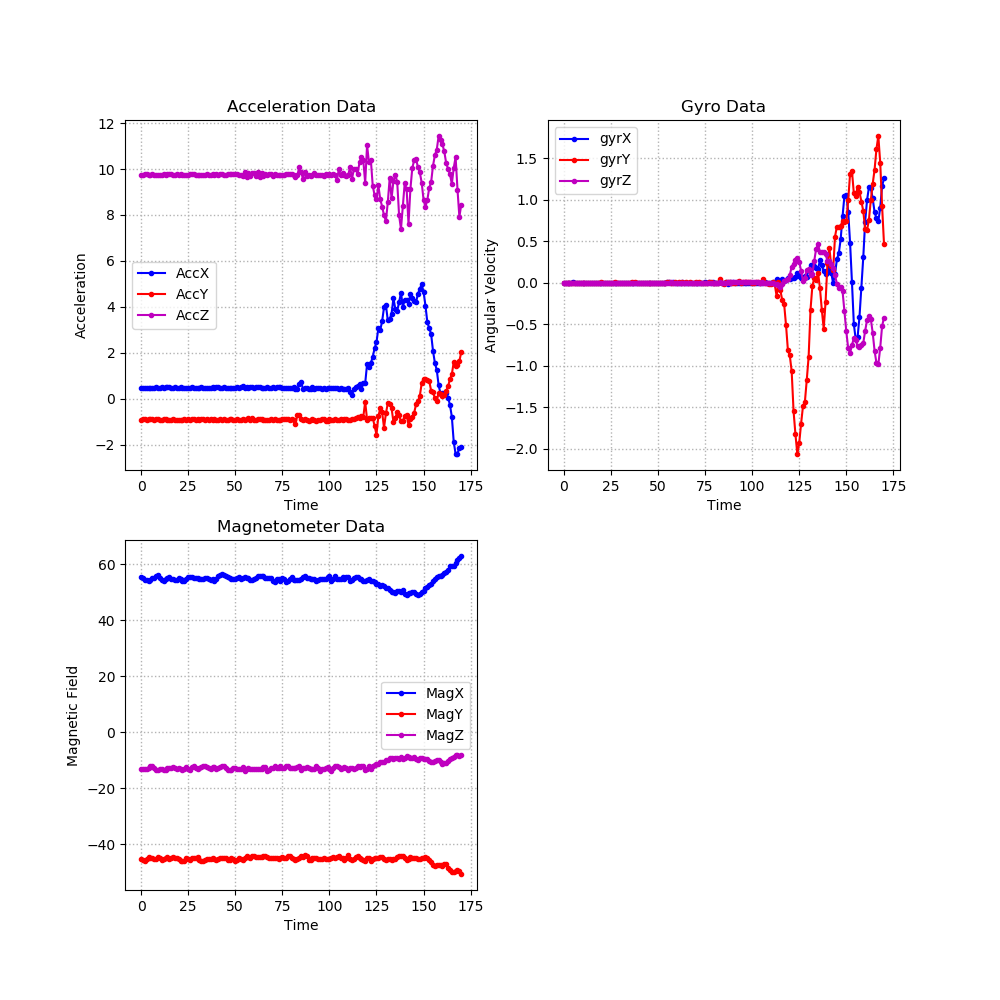

# DS-for-PPM
Basic Education of Data Science for Production Process Monitoring
```
데이터 사이언스 분야 생산공정 모니터링 이미지 처리 기법 강의 및 관련 실습(국가 경쟁력 강화를 위한 소재∙부품∙장비 산업 전문인력 양성과정)
- 오유근(홍익대학교 기계시스템디자인공학과 교수)
- 기간: 2020.02.12(수)~02.14(금) 09:00~18:00

교육내용 :
- 데이터 사이언스 개요
- 실시간 생산장비 데이터 취득 및 저장 기법
- 데이터 변환 및 가시화 기법, 데이터 분석 및 머신 러닝 기법
- 생산공정 모니터링 관련 이미지 처리 기법, 딥러닝을 활용한 이미지 분석 기법
 
실습교육 :
- 실시간 데이터 취득 및 저장 기법
- 머신러닝 활용 데이터베이스 데이터 분석
- 딥러닝 활용 생산공정 이미지 데이터 분석
```
- - -
## Day 1
- Python review
- Data acquistion
    - Website data scraping (사진, 일기예보, 실시간주가)
    - IMU(Inertial Measurement Unit) data
    </img>
    
### Code List
|Content|Code|
|-|-|
|python 기본|[Code](./day1/untitled0.py)|

- - -
## Day 2
- Database programming (SQL)
- Machine Learning
    - Supervised learning: regression, classification
    - (Optional) Unsupervised learning: clustering, PCA
- - -
## Day 3
- OpenCV 활용한ML
- (Optional) Team project

